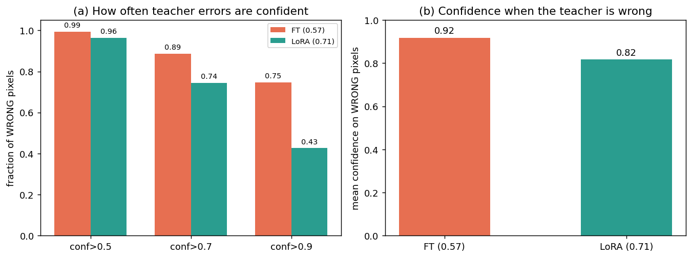
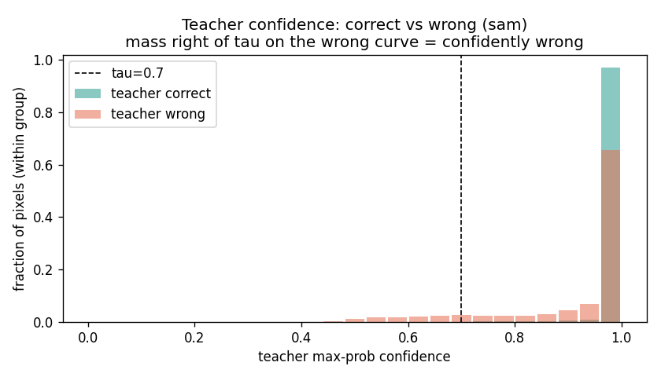
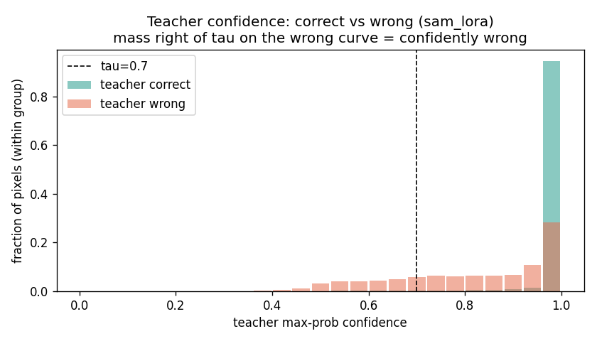
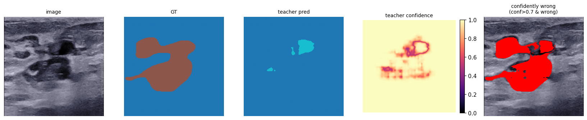
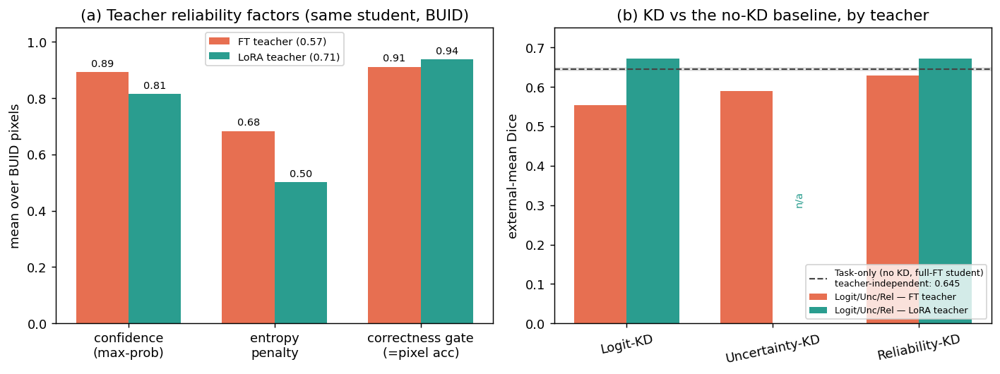
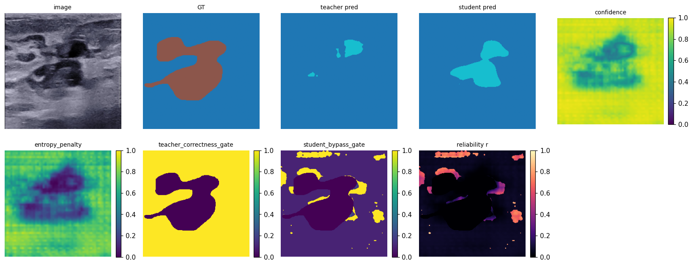
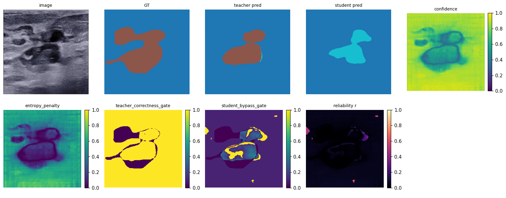
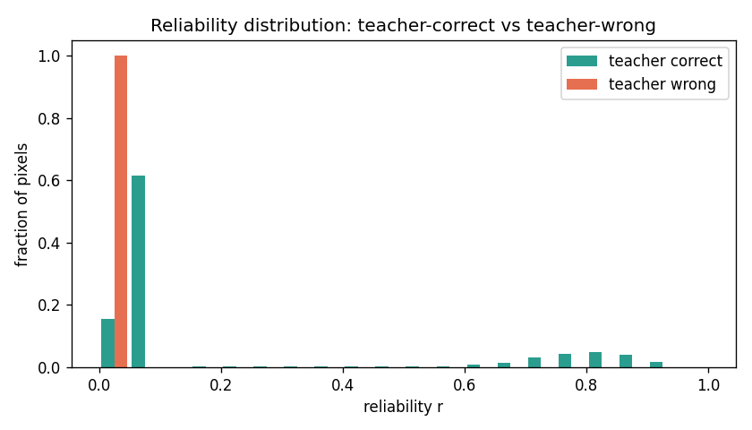
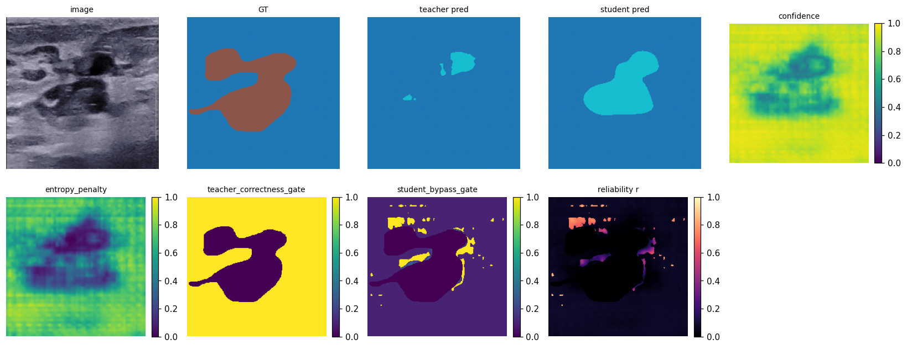

# Reliability-aware KD — Consolidated Results

One-stop summary of every analysis/visualization so far. Plan & design live in
[reliability_kd_study.md](reliability_kd_study.md); this file is results only.

Setup: students = TinyUSFM; teachers = SAM (full-FT ckpt, val Dice **0.57**) and
SAM (LoRA rank-4 ckpt, val Dice **0.71**). Data `dynamic` (num_classes=3); train
BUSBRA/BUSI/B, external test BUID/BUS_UCLM/BUS_UCLM_filtered. Metric focus: Dice
& Sensitivity. Per method the representative run is the **best BUID Dice** over
the hyperparameter sweep.

---

## 0. Motivation — the teacher is *confidently wrong*

Plain logit-KD distils every teacher pixel equally. But a frozen SAM teacher does
not just make errors — it makes **confident** errors, which plain KD injects into
the student almost as hard labels. Measured on BUID (teacher only, no student):



| BUID | SAM-FT (0.57) | SAM-LoRA (0.71) |
|---|---:|---:|
| mean confidence on **wrong** pixels | **0.918** | 0.817 |
| wrong pixels with conf > 0.9 | **74.7 %** | 42.7 % |
| wrong pixels with conf > 0.7 | **88.7 %** | 74.4 % |
| confidently-wrong (conf>0.9) share of all pixels | **6.6 %** | 2.6 % |

For the FT teacher, **~75 % of all its errors carry >0.9 confidence** — these are
exactly the pixels reliability-KD's `teacher_correctness_gate` zeroes out (§3).
Confidence histograms (note the high-confidence tail on the *wrong* curve):

| FT teacher | LoRA teacher |
|---|---|
|  |  |

Per-sample evidence (red = confidence > 0.7 **and** teacher ≠ GT):



This is the problem reliability-KD targets, and it also previews §2: the
better-calibrated LoRA teacher is *confidently wrong* far less often.

Tool: `tools/analyze_confidently_wrong.py teacher=<sam|sam_lora> analysis.loader=BUID`.

---

## 1. Headline comparison (best-per-method, by teacher)

External-mean over BUID + BUS_UCLM(+filtered). Bold = best Dice within a teacher.
Full per-test-set table: [kd_reliability_table.tex](kd_reliability_table.tex).

| Teacher | Method (rep) | ext Dice | ext Sens |
|---|---|---:|---:|
| SAM-FT (0.57) | Task-only (`base_task_only`) | **0.642** | 0.633 |
| SAM-FT (0.57) | Logit-KD (`base_logit_kd`) | 0.554 | 0.548 |
| SAM-FT (0.57) | Uncertainty-KD (`base_uncertainty_kd`) | 0.589 | 0.575 |
| SAM-FT (0.57) | Reliability-KD (`bs_8`) | 0.628 | 0.617 |
| SAM-LoRA (0.71) | Task-only (`task_only`) | 0.648 | 0.657 |
| SAM-LoRA (0.71) | Logit-KD (`logit_kd`) | **0.672** | 0.662 |
| SAM-LoRA (0.71) | Reliability-KD (`reliability`) | 0.671 | 0.634 |

Per-test-set highlights (Dice): with the LoRA teacher, **Reliability-KD wins
BUID (0.703)** and BUSI (0.692); Logit-KD edges the external mean by 0.001.

**Two findings:**
1. **Teacher quality flips KD's verdict.** Weak FT teacher → every KD variant is
   *below* task-only (reliability is the least-bad). Strong LoRA teacher → KD
   *beats* task-only, and reliability/​logit-KD are effectively tied at the top.
2. **Among KD methods, Reliability-KD ≥ Logit-KD/Uncertainty-KD on Dice in the
   weak-teacher regime** (FT: 0.631 vs 0.554) — its benefit is concentrated
   exactly where the teacher is unreliable.

### Three-way: does KD help at all? (LaTeX: [kd_reliability_3way.tex](kd_reliability_3way.tex))

| Teacher → Student | Teacher Dice | Task-only | Reliability-KD | Logit-KD | KD |
|---|:--:|---:|---:|---:|:--:|
| SAM full-FT → TinyUSFM | 0.57 | 0.642 | 0.631 (−0.011) | 0.554 (−0.088) | **hurts** |
| SAM LoRA → TinyUSFM | 0.71 | 0.648 | **0.671 (+0.023)** | **0.672 (+0.024)** | **helps** |
| TinyUSFM → SAM | 0.71 | 0.546 | 0.534 (−0.012) | — | **hurts** |

**KD helps in exactly one of three directions** — SAM-LoRA → TinyUSFM. The
controlling factors:
- **Teacher must be strong AND calibrated** (rules out row 1: FT teacher 0.57, overconfident).
- **Student should be *smaller* than the teacher's effective capacity** (rules out
  row 3: even a good TinyUSFM teacher can't lift a large SAM student that already
  fits the data and overfits by epoch ~7). KD then injects a conflicting,
  lower-capacity signal.
- When it helps (row 2), reliability-KD ≈ logit-KD on the external mean; reliability
  wins on BUID alone (0.703) and is the safer choice in the weak-teacher regime.

### Fair comparison under matched sampling (LaTeX: [kd_reliability_sampled_fair.tex](kd_reliability_sampled_fair.tex))

The §3 main sweep teachers were trained **without** the balanced sampler, and the
SAM-FT teacher was an old, under-tuned artifact (val 0.57). Re-training **both
teachers with the sampler** (same recipe) and distilling into a **sampled**
student isolates the teacher-adaptation effect fairly:

| Teacher (val Dice) | Method | ext Dice | ext Sens | int Dice | Δ ext |
|---|---|---:|---:|---:|---:|
| — | Task-only (no KD) | 0.619 | 0.631 | 0.765 | — |
| FT-sampled (0.682) | logit-KD | 0.642 | 0.647 | 0.734 | +0.024 |
| FT-sampled (0.682) | reliability-KD | 0.637 | 0.615 | 0.759 | +0.018 |
| LoRA-sampled (0.720) | logit-KD | **0.671** | **0.678** | 0.742 | +0.053 |
| LoRA-sampled (0.720) | reliability-KD | 0.642 | 0.624 | **0.774** | +0.024 |

What changes once the teacher is trained fairly:
- **Sampling lifts the FT teacher 0.57 → 0.682** (+0.11) — the old FT teacher was
  simply under-trained, not evidence that full-FT is inherently bad.
- **Now every KD variant beats task-only** (unlike §3, where the weak FT teacher
  made KD hurt). A decent teacher is the precondition for KD to help — confirmed.
- **LoRA-sampled is still the better teacher** (best external 0.671 vs FT 0.642),
  so the LoRA advantage is *not* a sampling artifact — it is the adaptation itself.
- **Plain logit-KD slightly edges reliability-KD on the external mean here**;
  reliability-KD is more conservative (lower Sens) but takes the **internal** Dice
  (0.774) and is competitive on BUID. With a well-trained teacher the reliability
  gating's safety margin shrinks — its biggest wins remain the weak-teacher regime.

---

## 2. Why does the LoRA teacher distil better?



Measured on identical BUID pixels with the same student, the two teachers differ
in exactly the way KD theory predicts a *good* teacher should:

| BUID, same student | SAM-FT (0.57) | SAM-LoRA (0.71) |
|---|---:|---:|
| `teacher_correctness_gate` (= pixel accuracy) | 0.911 | **0.938** |
| `confidence` (max-prob) | 0.892 | 0.814 |
| `entropy_penalty` (1−H/logC) | 0.683 | 0.501 |

- **More accurate**: the LoRA teacher agrees with GT on more pixels (0.938 vs
  0.911), so fewer pixels are hard-gated away by the correctness gate — more
  *trustworthy* KD signal survives.
- **Better calibrated / less overconfident**: lower max-prob confidence (0.81 vs
  0.89) and higher entropy (entropy_penalty 0.50 vs 0.68). Full fine-tuning on
  the small ultrasound sets makes SAM **overconfident**; rank-4 LoRA's tiny
  trainable budget acts as a regulariser, yielding softer, better-calibrated
  targets — the classic "good teacher" for distillation.
- **Net effect** (panel b): the student's external Dice rises for every method
  under the LoRA teacher, and KD overtakes task-only.

Qualitative teacher reliability maps (same image, BUID):

| FT teacher | LoRA teacher |
|---|---|
|  |  |

> Takeaway: it is not "LoRA is magic" — it is that **LoRA regularisation makes a
> better-calibrated, more-accurate teacher**, and KD (reliability-weighted in
> particular) converts that into a better student.

---

## 3. Reliability factors — what each one does

The per-pixel reliability `r ∈ [0,1]` is a product of factors, each suppressing
KD where the teacher signal is untrustworthy for a different reason:

```
r = confidence × entropy_penalty × teacher_correctness_gate × student_bypass_gate
    (optionally → prediction-aware smoothing)
```

| Factor | Needs GT? | What it computes | Effect on KD weight |
|---|:--:|---|---|
| **confidence** (`max_prob`) | no | teacher's max-class softmax prob per pixel | base weight: unsure teacher pixels count less |
| **entropy_penalty** | no | `1 − H(p)/log C` (normalised entropy) | ↓ on high-entropy (flat/uncertain) pixels; ≈1 when peaked |
| **teacher_correctness_gate** | **yes** | checks `teacher_pred == GT` directly | wrong → `wrong_weight` (0 = off), correct → 1. **The only factor that kills confidently-WRONG teacher pixels** (§0) |
| **student_bypass_gate** | **yes** | compares student vs teacher vs GT | student already confidently right → down-weight (`bypass_weight`); student wrong but teacher right → *rescue* (ramp up); both wrong → off |
| *reliability_smoothing* (opt.) | no | bilateral averaging guided by teacher-prediction similarity | shares `r` within consistently-predicted regions, not across edges. **Off by default — it hurt in our sweeps** (§4) |

Intuition: `confidence` / `entropy_penalty` scale by the teacher's *own*
uncertainty (they can never override a confidently-wrong teacher); the two
GT-conditioned gates add the supervision the confidence factors lack —
`teacher_correctness_gate` removes confident teacher errors, `student_bypass_gate`
avoids dragging an already-correct student back toward a weaker teacher.

## 4. Reliability map — does it do what it claims?

Full-map student on BUID ([analysis](../logs/reliability_analysis/20260619_092418/)):



```
mean reliability | teacher CORRECT : 0.223
mean reliability | teacher WRONG   : 0.000      <- confidently-wrong teacher pixels fully gated
frac of wrong pixels gated (<0.1)  : 1.000
component means: confidence 0.89 · entropy 0.68 · teacher_gate 0.91 · student_bypass 0.29
```

Mechanism confirmed (H2): the map drives KD weight to ~0 on every pixel where the
teacher disagrees with GT, while keeping signal where the teacher is right. The
`student_bypass` factor (mean 0.29) is the dominant down-weighter — KD is skipped
where the student is already confidently correct.

Per-sample panel (image · GT · teacher · student · each factor · final r):



---

## 5. Ablation (SAM-FT teacher, full 20-run sweep)

Source: [summary_table.md](../logs/reliability_ablation/20260619_022030/summary_table.md).

**Factor ablation** (LaTeX: [kd_reliability_factor_ablation.tex](kd_reliability_factor_ablation.tex)):

| Config | T-gate | S-byp | Smooth | ext Dice | ext Sens | BUID Dice |
|---|:--:|:--:|:--:|---:|---:|---:|
| confidence × entropy | -- | -- | -- | 0.587 | 0.544 | 0.605 |
| + teacher gate | ✓ | -- | -- | **0.630** | 0.622 | 0.652 |
| + student bypass (full) | ✓ | ✓ | -- | 0.614 | 0.591 | 0.648 |
| + smoothing | ✓ | ✓ | ✓ | 0.597 | 0.578 | 0.636 |
| full − teacher gate | -- | ✓ | -- | 0.584 | 0.574 | 0.619 |

(confidence & entropy always on.) Takeaways:
- **`teacher_correctness_gate` is the workhorse**: +0.044 ext Dice when added
  (b0 0.587 → b1 0.630), and removing it from the full map costs −0.030
  (0.614 → 0.584).
- **student_bypass slightly hurts here** (0.630→0.614) and **smoothing hurts**
  (0.614→0.597) for this weak FT teacher → keep smoothing off.
- Hyperparameter sweep (full table): variants cluster 0.59–0.66 ext Dice; T=2 ≥
  T=6/8; hard teacher gate (`wrong=0.0`) + default student bypass near-optimal.

---

## 6. Status & how to continue

| Sweep | Done | Remaining |
|---|---|---|
| FT main ablation | 20/20 | — |
| LoRA core (`092041`) | 4/4 | — |
| LoRA hyperparameter | temp_2/8 | tg_wrong_0.25, sb_weight_0.3 |
| TinyUSFM→SAM | task_only | reliability, temp_2/8, tg_wrong_0.25, sb_weight_0.3 |

Resume (skips finished, continues partials from `last.pth`):
```bash
uv run tools/run_reliability_ablation.py --manifest config/sweeps/reliability_teacher_tinyusfm.yaml \
    --group reliability_teacher_tinyusfm --resume --workers gpu4:0,gpu4:1,gpu4:2,gpu4:3
uv run tools/run_reliability_ablation.py --manifest config/sweeps/reliability_teacher_lora.yaml \
    --group reliability_teacher_lora --resume --workers gpu4:0,gpu4:1
```
Regenerate tables after: `uv run tools/summarize_reliability_sweep.py <sweep_dir>`.
